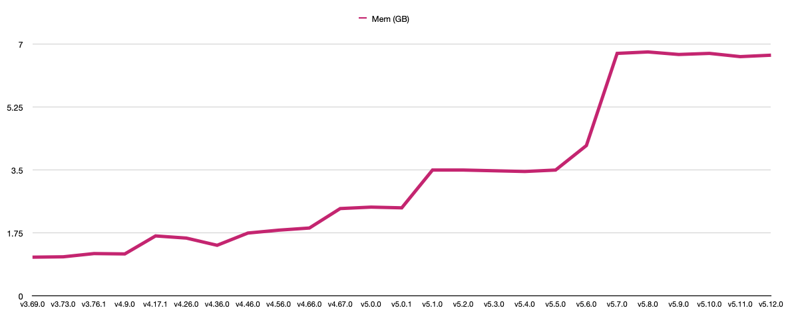
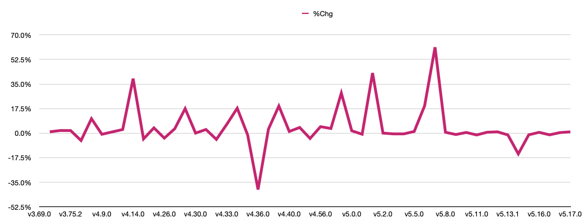

# awsprovmemprof
Terraform AWS Provider memory usage changes

This graph shows the changes in memory usage while running a single VPC acceptance test over time.

This graph shows the percent change in memory usage while running a single VPC acceptance test over time.

## Biggest changes

These are the changes larger than +/- 5% since v3.69.0.

| From Ver | To Ver | From Alloc (G) | To Alloc (G) | % Change |
| --- | --- | --- | --- | --- |
| v3.73.0 | v3.76.1 | 1.09 | 1.18 | 8.3% |
| v4.13.0 | v4.14.0 | 1.21 | 1.68 | 38.8% |
| v4.28.0 | v4.29.0 | 1.66 | 1.95 | 17.5% |
| v4.32.0 | v4.33.0 | 1.91 | 2.03 | 6.3% |
| v4.33.0 | v4.34.0 | 2.03 | 2.39 | 17.7% |
| v4.35.0 | v4.36.0 | 2.36 | 1.41 | -40.3% |
| v4.38.0 | v4.39.0 | 1.45 | 1.73 | 19.3% |
| v4.66.0 | v4.67.0 | 1.89 | 2.43 | 28.6% |
| v5.0.1 | v5.1.0 | 2.45 | 3.50 | 42.9% |
| v5.5.0 | v5.6.0 | 3.50 | 4.18 | 19.4% |
| v5.6.0 | v5.7.0 | 4.18 | 6.74 | 61.2% |
