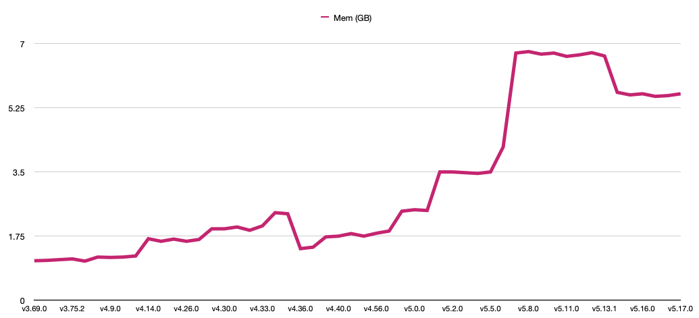

# awsprovmemprof
Terraform AWS Provider memory usage changes

This graph shows the changes in memory usage while running a single VPC acceptance test over time.



This graph shows the percent change in memory usage while running a single VPC acceptance test over time.


## Biggest changes

These are the changes larger than +/- 5% since v3.69.0.

| From Ver | To Ver | From Alloc (G) | To Alloc (G) | % Change |
| --- | --- | --- | --- | --- |
| v3.73.0 | v3.76.1 | 1.09 | 1.18 | 8.3% |
| v4.13.0 | v4.14.0 | 1.21 | 1.68 | 38.8% |
| v4.28.0 | v4.29.0 | 1.66 | 1.95 | 17.5% |
| v4.32.0 | v4.33.0 | 1.91 | 2.03 | 6.3% |
| v4.33.0 | v4.34.0 | 2.03 | 2.39 | 17.7% |
| v4.35.0 | v4.36.0 | 2.36 | 1.41 | -40.3% |
| v4.38.0 | v4.39.0 | 1.45 | 1.73 | 19.3% |
| v4.66.0 | v4.67.0 | 1.89 | 2.43 | 28.6% |
| v5.0.1 | v5.1.0 | 2.45 | 3.50 | 42.9% |
| v5.5.0 | v5.6.0 | 3.50 | 4.18 | 19.4% |
| v5.6.0 | v5.7.0 | 4.18 | 6.74 | 61.2% |

## Delve deeper into these profiles

All the profiles I created are included in this repo. You can look into them more deeply.

To read the profiles install [`pprof`](https://github.com/google/pprof):

```
go install github.com/google/pprof@latest
```

and `graphviz`:

```
brew install graphviz
```

Clone the repo and graphically examine, for example, the `v5.12.0` profile using a random available port `4599`:

```
git clone https://github.com/YakDriver/awsprovmemprof.git
cd awsprovmemprof
cd vpc
pprof -http=localhost:4599 mem-v5.12.0.prof
```

There is a lot more you can do with the profiles using [`pprof`](https://github.com/google/pprof).

## Method

To create your own profiles using my method, here it is.

In order to find the memory used, I ran a single, simple acceptance test (`TestAccVPC_basic`) to minimize noise from parallelism and the testing framework. I used the same version of Go (v1.21.0) and Terraform itself (v1.5.5) for all the tests to ensure differences were in the provider. I profiled with Go and read the profile with [`pprof`](https://github.com/google/pprof).

This command will create CPU and memory profiles of the test run:

```sh
TF_ACC=1 go test \
		./internal/service/ec2/... \
		-v -parallel 1 \
		-run='^TestAccVPC_basic$' \
		-cpuprofile cpu.prof \
		-memprofile mem.prof \
		-bench \
		-timeout 60m
```

To read the profile, as prerequisites, install [`pprof`](https://github.com/google/pprof):

```
go install github.com/google/pprof@latest
```

and `graphviz`:

```
brew install graphviz
```

Randomly picking an available port `4599`, you can view the profile graphically in your browser:

```sh
pprof -http=localhost:4599 mem.prof
```

This is a simple script I used:

```bash
export ver=v3.74.3
git checkout ${ver}
TF_ACC=1 go test \
		./internal/service/ec2/... \
		-v -parallel 1 \
		-run='^TestAccVPC_basic$' \
		-cpuprofile cpu-${ver}.prof \
		-memprofile mem-${ver}.prof \
		-bench \
		-timeout 60m
pprof -http=localhost:4599 mem-${ver}.prof
```

Once `pprof` loads the profile in the browser, click `View` and `Flame Graph` to see a conveniently tallied total:


There is a lot more you can do with a profile using [`pprof`](https://github.com/google/pprof).
